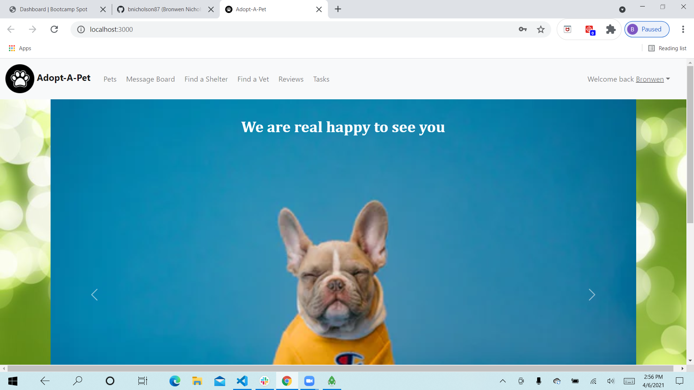

# Adopt-A-Pet

  An app where you can find pets that are up for adoption and resources available such as animal shelters and vet offices

  # Table of Contents:
  *[Installation](#installation)
  *[Usage](#usage)
  *[Test](#test)
  *[Contributions](#contributions)
  *[Questions](#questions)
  *[License](#license)
  
  
  ## Installation 
  
  React, bcrypt, leaflet and petfinder are all required
  
  ## Usage
  
 Once you login, you can view pets that are up for adoption, send/reply to messages on the message board, review serices that you have received, and view links to available resources

 ## Test

 By running it to make sure it works
  
  ## Contributions
  
  Group effort between Adam Aranha, Bill Hronis, Jordan Mossing, Bronwen Nicholson and Catherine Shaw

  ## License
  
  None

  Screenshot: 
  https://github.com/daze77/adoptaPet-Test.git